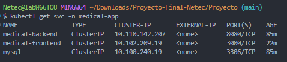

# Proyecto Final Douglas Ferrer

Implementación completa de una app de ejemplo para gestión de doctores:
- **Backend**: Spring Boot + JPA (MySQL)
- **Frontend**: React
- **DB**: MySQL 5.7
- **Orquestación**: Kubernetes (Docker Desktop)
- **Exposición**: Ingress NGINX


---

## 1) Arquitectura (resumen)

- Persistencia con **PVC**.
- **Init SQL** crea BD/tabla y carga datos **sin duplicar** (índice único + `INSERT IGNORE`).
- **Ingress** publica:
  - `http://proyectodouglas.local/` → Frontend
  - `http://proyectodouglas.local/api/...` → Backend (rewrite a `/`)
- (Opcional) **NetworkPolicy**: sólo backend puede hablar con MySQL.

---

## 2) Requisitos

- **Docker Desktop** con Kubernetes habilitado (contexto `docker-desktop`).
- **kubectl** y **bash** disponibles.
- Entrada en `hosts`:
  ```
  127.0.0.1  proyectodouglas.local
  ```

---

## 3) Despliegue rápido

```bash
# Clonar y entrar al repo
git clone https://github.com/djferrer/ProyectoFinal
cd Proyecto

# Despliegue limpio (borra el namespace si existe y crea todo)
./deploy_project.sh
```

Verificación:

```bash
kubectl -n medical-app get pods,svc
kubectl -n medical-app get ingress
```

- Frontend: `http://proyectodouglas.local/`
- API: `http://proyectodouglas.local/api/doctor`
- Swagger: `http://proyectodouglas.local/api/swagger-ui/index.html`

> Alternativa: `./run_project.sh` (aplica manifiestos y crea port-forward locales; útil sin Ingress).

---

## 4) Imágenes Docker & build (latest)

**Backend**
```bash
cd BE/ms-medical
./gradlew clean build -x test

docker build -t djferrer/proyectofinal-backend:latest .
docker push djferrer/proyectofinal-backend:latest
kubectl -n medical-app rollout restart deployment/contact-backend
```

**Frontend**  
El frontend usa `.env` para la URL del backend (quedó horneada en build):
```
REACT_APP_API_BASE_URL=http://proyectodouglas.local/api
```

```bash
cd FE/medical-frontend

docker build -t djferrer/proyectofinal-frontend:latest .
docker push djferrer/proyectofinal-frontend:latest
kubectl -n medical-app rollout restart deployment/medical-frontend
```

---

## 5) Manifiestos Kubernetes (carpeta `k8s/`)

- Base:
  - `namespace.yaml`
  - `secret.yaml` (clave root)
  - `mysql-volume.yaml` (PVC)
- MySQL:
  - `mysql-deployment.yaml`
  - `mysql-service.yaml`
  - `mysql-initdb-configmap.yaml`  
    > Crea **db_medical**, tabla **doctors** con índice único `(name, specialty)` y usa `INSERT IGNORE` (evita duplicados).
- Backend:
  - `backend-deployment.yaml`
  - `backend-service.yaml`
- Frontend:
  - `frontend-deployment.yaml`
  - `frontend-service.yaml`
- Ingress:
  - `ingress-frontend.yaml`  → `proyectodouglas.local/` → servicio `medical-frontend:3000`
  - `ingress-backend.yaml`   → `proyectodouglas.local/api/...` → `medical-backend:8080` (rewrite a `/`)
- (Opcional) Seguridad:
  - `networkpolicy-mysql.yaml` (limita acceso a MySQL sólo desde pods del backend)

Aplicación/actualización:
```bash
kubectl -n medical-app apply -f k8s/
```

---

## 6) Monitoreo y observabilidad

**Metrics Server**
```bash
kubectl apply -f k8s/metrics-server-deployment.yaml
sleep 10
kubectl -n medical-app top pods
kubectl top nodes
```

**Logs**
```bash
kubectl -n medical-app logs -l app=medical-backend --tail=200
```

---

## 7) Persistencia y semilla

- El PVC `mysql-pvc` conserva los datos entre reinicios.
- Para resembrar desde el `ConfigMap` (y comenzar limpio):
  ```bash
  ./reset_project.sh
  ./deploy_project.sh
  ```
- La tabla `doctors` tiene **índice único** `(name, specialty)` para impedir registros repetidos.

---

## 8) Evidencias (capturas)

- Pods listos:  
  
- Services:  
  
- Rollout completado:  
  
- Swagger 200:  
  
- Frontend cargando listado:  
  
- Logs backend (arranque / JPA):  
  
- Imágenes en Docker Hub:  
    
  

---

## 9) Estructura del repo

```
BE/ms-medical/                # Spring Boot + Dockerfile
FE/medical-frontend/          # React + Dockerfile (.env usa REACT_APP_API_BASE_URL)
k8s/                          # Manifiestos (DB, app, ingress, seguridad, métricas)
img/                          # Evidencias usadas en este README
deploy_project.sh             # Despliegue limpio con esperas
run_project.sh                # Aplicación + (opcional) port-forward
reset_project.sh              # Limpieza total (borra namespace y PVC)
README.md
```

---

## 10) Pruebas rápidas

```bash
# API via Ingress
curl -H "Host: proyectodouglas.local" http://localhost/api/doctor

# Frontend via Ingress
curl -I -H "Host: proyectodouglas.local" http://localhost/
```

---

**Fin.**  
Cualquier revisión puede iniciarse con `./deploy_project.sh` y validarse en `http://proyectodouglas.local/` y `http://proyectodouglas.local/api/doctor`.
